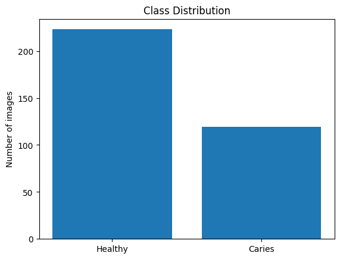
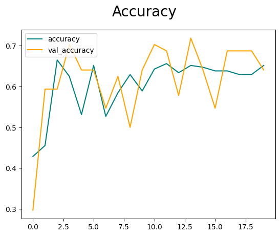
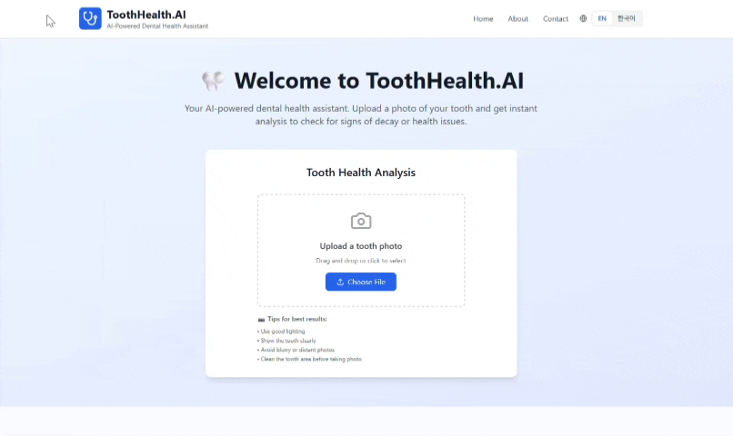

**🦷 Dental Image Classification**

A binary image classification project that detects Healthy vs Caries teeth using Convolutional Neural Networks (CNN). This project uses data augmentation and class imbalance handling techniques to improve performance.

**📂 Dataset**

Two classes:

- Healthy Teeth
- Caries
- Image size standardized to 256x256 for model input.

**🧠 Model Architecture**

- A basic CNN built with Tensorflow/Keras:

model = Sequential([
data_augmentation, # Real-time data augmentation
Rescaling(1./255), # Normalize pixel values
Conv2D(16, (3,3), activation='relu', input_shape=(256,256,3)),
MaxPooling2D(),
Conv2D(32, (3,3), activation='relu'),
MaxPooling2D(),
Conv2D(16, (3,3), activation='relu'),
MaxPooling2D(),
Flatten(),
Dense(256, activation='relu'),
Dense(1, activation='sigmoid') # Binary classification
])

**🔄 Data Augmentation**

To combat overfitting and improve generalization, the following augmentation is applied:

data_augmentation = tf.keras.Sequential([
layers.RandomFlip("horizontal"),
layers.RandomRotation(0.1),
layers.RandomZoom(0.1),
layers.RandomTranslation(0.1, 0.1)
])

**⚖️ Handling Class Imbalance**

from sklearn.utils import class_weight

class_weights = class_weight.compute_class_weight(
'balanced',
classes=np.unique(y_train),
y=y_train
)

**Results**
Accuracy: 93.3%

Testing korean version:

Testing english version:

